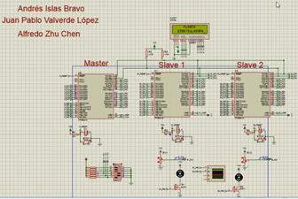
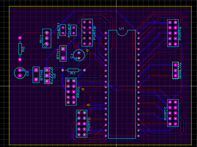
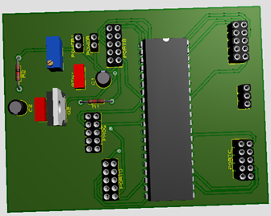

# Microcontroller LAB 

 
-----------------

All lab codes are uploaded. A final project using ATMEGA16's Two-wire Interface is developed. The course and the content is in spanish. 

##  Final project with report written in spanish 
This project is mainly focused on the recapitulation and situational appliance of a broad range of qualities of microcontrollers, for this particular case an ATMega16. The microcontrollers are present in many artefacts, performing basic but fundamental tasks, and now their task is the automatization of a bottling plant. This by implementing communication protocols (I2C also named as TWI for the ATMEGA family), arithmetic decisions, ADC and LCD, all searching for the fastest and, more importantly, the most optimal performance. 

https://github.com/Alfzzz/Microcontroller-ATMEGA16-LAB/blob/main/proyecto%20final/E5_FINAL/E5_FINAL.pdf

 
## Final project video: 

https://www.youtube.com/watch?v=X1VcqQrWxmI
